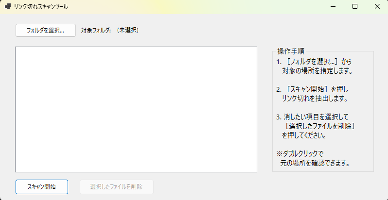

# ShortcutLinkChecker (リンク切れスキャンツール)

Windows上の指定したフォルダ内にあるショートカットファイル（.lnk）をスキャンし、リンク先が消滅している「リンク切れ」状態のファイルを抽出・削除するためのツールです。

## 開発背景
インフラエンジニアとして業務を行う中で、深いディレクトリ階層やファイル移動に伴い発生する「リンク切れショートカット」の整理を効率化するために開発しました。
特に、現場で扱いやすいよう「パスのコピー」や「ウィンドウサイズへの柔軟な対応」といった実用性にこだわっています。

## 主な機能
- **高速スキャン**: 指定フォルダ内の全ショートカットをチェックし、リンク先の存否を確認します。
- **直感的な操作**: 抽出された項目をリストアップし、選択したファイルを一括削除できます。
- **実用的なUI設計**:
    - **レスポンシブレイアウト**: ウィンドウのリサイズに合わせてリストボックスが伸縮します。
    - **インフラ配慮のパス表示**: 長いフォルダパスも読み取り専用テキストボックスで表示し、コピーや横スクロールが可能です。
    - **ダブルクリック連携**: リスト上の項目をダブルクリックすることで、そのファイルのプロパティ（元の場所）を即座に確認できます。

## 技術スタック
- **言語**: C# ( .NET 10.0-windows )
- **フレームワーク**: Windows Forms(デスクトップUI)
- **外部ライブラリ**: COM参照 (Windows Script Host Object Model) ※ショートカット解析用

## 使用方法
1. 「フォルダを選択...」ボタンから対象のディレクトリを指定します。
2. 「スキャン開始」ボタンを押すと、リンク切れファイルが中央のリストに表示されます。
3. 削除したいファイルを選択（複数選択可）し、「選択したファイルを削除」を押します。
   - ※削除前にダブルクリックで詳細を確認することを推奨します。

## 今後のアップデート予定
- ネットワークドライブ上のショートカットへの対応強化
- スキャン結果のCSVエクスポート機能